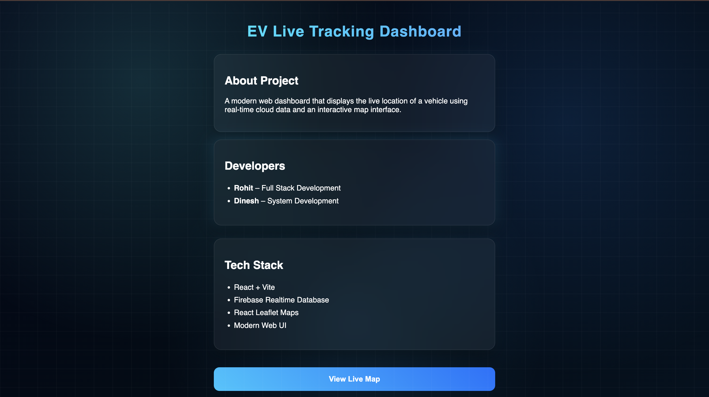
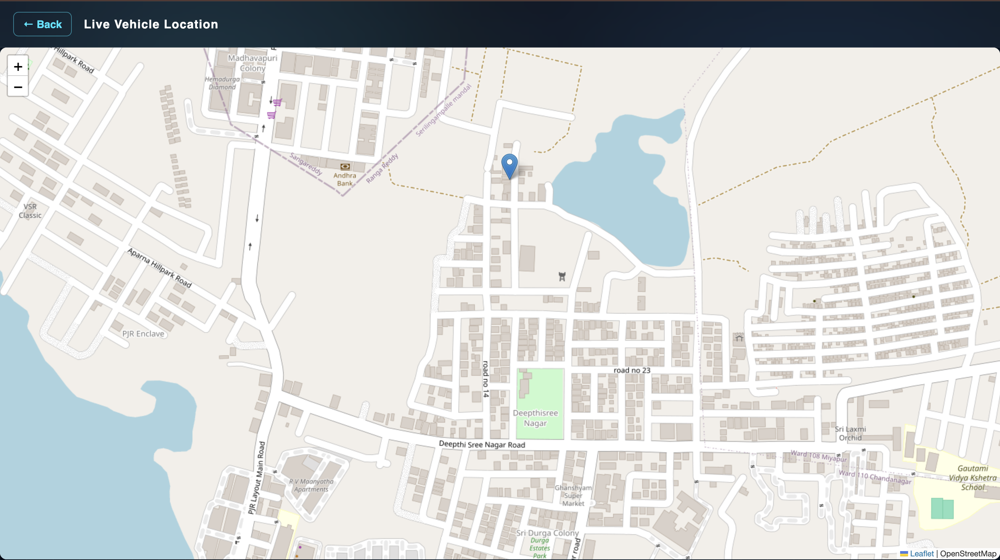
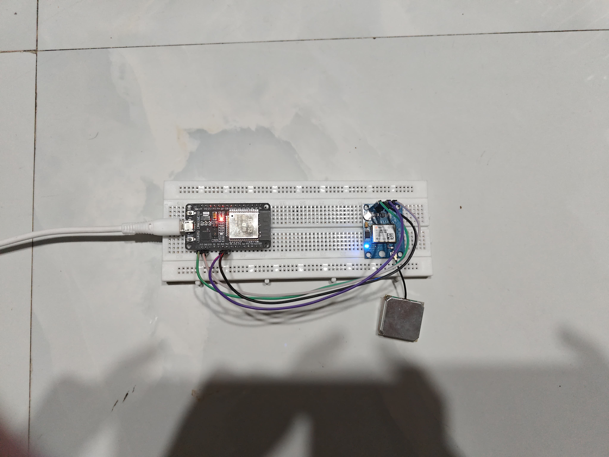
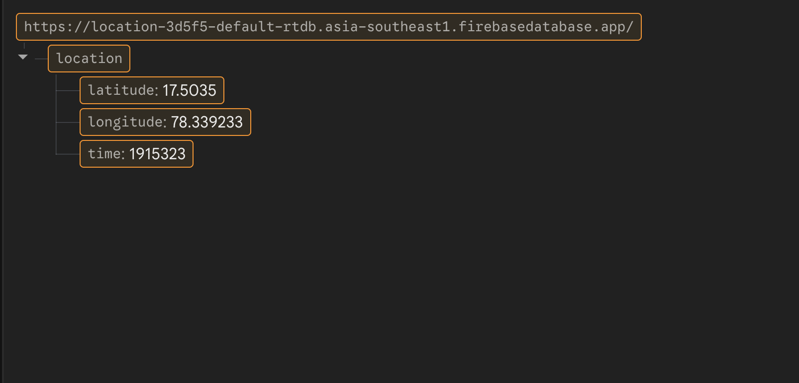

# 🚗 EV Live Tracking System

A real-time IoT-based vehicle tracking system that captures GPS data using an ESP32 and visualizes it on a live web dashboard.

---

## 🔴 Live Demo
https://ev-tracker-map.vercel.app

---

## ⚙️ Tech Stack

### Hardware
- ESP32
- GPS Module (NEO-6M)

### Backend / Cloud
- Firebase Realtime Database

### Frontend
- React + Vite
- Leaflet Maps

### Deployment
- Vercel

---

## 📡 How It Works

1. ESP32 reads real-time GPS coordinates  
2. Sends data to Firebase Realtime Database  
3. React app fetches live data  
4. Leaflet map updates location in real-time  

**Pipeline:** ESP32 → Firebase → React Dashboard → Live Map

---

## ✨ Features

- Real-time vehicle tracking  
- Live map visualization  
- Cloud-based data synchronization  
- Lightweight and responsive UI  

---

## 📸 Screenshots

---

## 🚀 Installation & Setup

git clone https://github.com/Rohit-NITW/ev-tracker-map.git 
cd your-repo  
npm install  
npm run dev  

---

## 📌 Future Improvements

- Route history tracking  
- Speed and distance analytics  
- Multiple vehicle tracking  
- Mobile responsiveness improvements  

---

## 👨‍💻 Author

Rohit Y

---

## ⭐ Note

This project demonstrates an end-to-end IoT pipeline from embedded hardware to cloud database to a real-time web interface.
